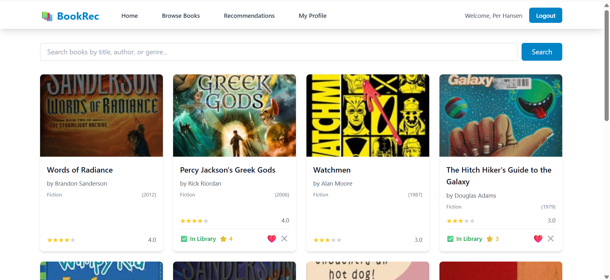
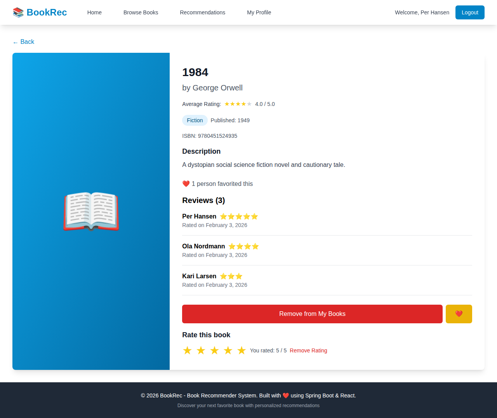
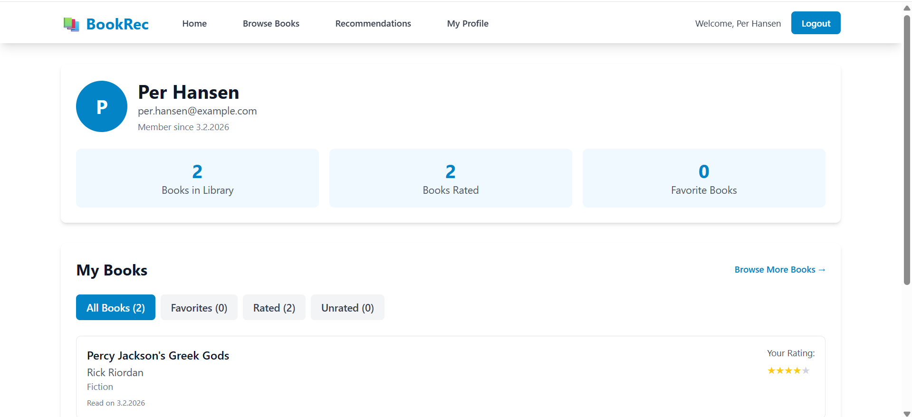
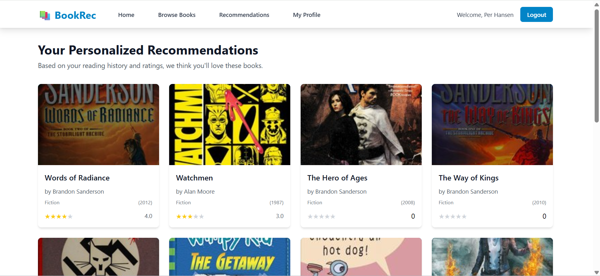

# 📚 BookRec - Book Recommendation System


A full-stack book recommendation application with personalized suggestions based on your reading history.

## Screenshots

<p align="center">
  
  
</p>
<p align="center">
  
  
 
</p>

## Tech Stack

| Frontend | Backend | Database |
|----------|---------|----------|
| React 18 | Spring Boot 3.2 | PostgreSQL |
| Tailwind CSS | Spring Security | H2 (dev) |
| Vite | JWT Auth | JPA/Hibernate |
| Axios | Swagger/OpenAPI | |

## Quick Start

### Using Docker (Recommended)
```bash
git clone https://github.com/mikailb/bookrecommender.git
cd bookrecommender
docker-compose up -d
```
- Frontend: http://localhost:3000
- Backend: http://localhost:8080
- API Docs: http://localhost:8080/swagger-ui.html

### Manual Setup

**Backend:**
```bash
./mvnw spring-boot:run -Dspring-boot.run.profiles=dev
```

**Frontend:**
```bash
cd frontend
npm install && npm run dev
```

## Demo Accounts

| User | Email | Password |
|------|-------|----------|
| Per Hansen | per.hansen@example.com | password123 |
| Ola Nordmann | ola.nordmann@example.com | password123 |
| Kari Larsen | kari.larsen@example.com | password123 |
| Emma Johansen | emma.johansen@example.com | password123 |

## Features

- 🔐 JWT Authentication with refresh tokens
- 📚 Browse and search books
- ⭐ Rate books (1-5 stars)
- ❤️ Favorite books
- 🎯 Personalized recommendations
- 👥 See other users' reviews
- 📱 Responsive design

## API Endpoints

| Method | Endpoint | Description |
|--------|----------|-------------|
| POST | /api/auth/register | Register user |
| POST | /api/auth/login | Login |
| GET | /api/books | List books (paginated) |
| GET | /api/books/:id | Book details + reviews |
| POST | /api/users/books/:id | Add to library |
| POST | /api/users/books/:id/rate | Rate book |
| GET | /api/recommendations | Get recommendations |

Full API docs: [Swagger UI](http://localhost:8080/swagger-ui.html)

## Project Structure

```
├── src/                    # Spring Boot backend
│   ├── controller/         # REST controllers
│   ├── service/            # Business logic
│   ├── repository/         # Data access
│   └── entity/             # JPA entities
├── frontend/               # React frontend
│   ├── components/         # React components
│   ├── services/           # API services
│   └── context/            # Auth context
├── docker-compose.yml      # Docker setup
└── .github/workflows/      # CI/CD
```

## License

MIT

